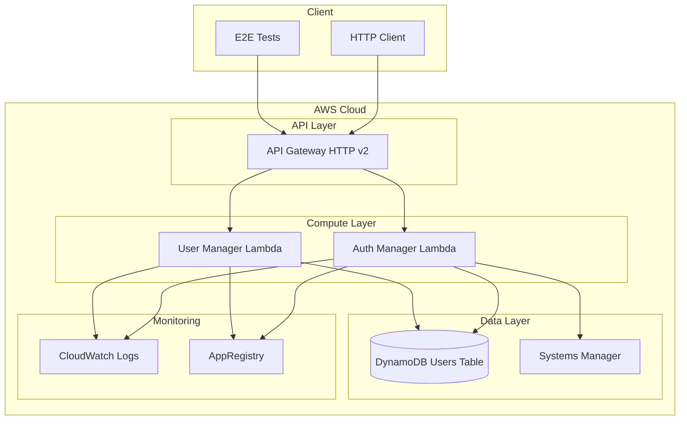
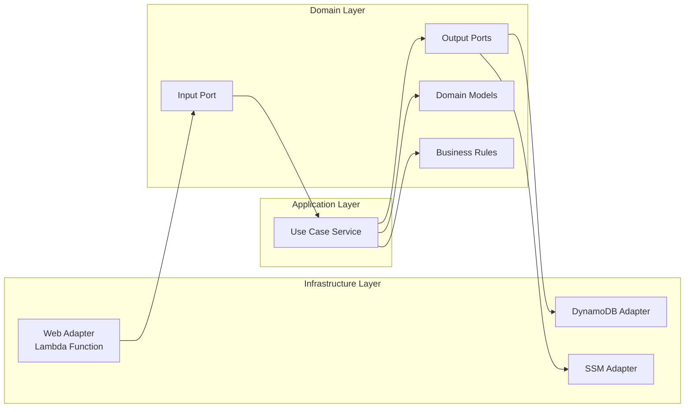

# serverless-back


[](https://sonarcloud.io/summary/new_code?id=pedroenlanube_serverless-back)
[](https://sonarcloud.io/summary/new_code?id=pedroenlanube_serverless-back)
[](https://sonarcloud.io/summary/new_code?id=pedroenlanube_serverless-back)
[](https://sonarcloud.io/summary/new_code?id=pedroenlanube_serverless-back)
[](https://sonarcloud.io/summary/new_code?id=pedroenlanube_serverless-back)

Aplicación serverless modular desarrollada con **Java 21** y **arquitectura hexagonal**. Cada módulo se puede desplegar independientemente usando Terraform.

## Stack Tecnológico

- **Java 21** con Spring Cloud Function 4.3.0
- **Spring Boot 3.5.4** - Framework base
- **Maven** para gestión de dependencias (multi-módulo)
- **AWS Lambda** para funciones serverless
- **DynamoDB** para persistencia NoSQL
- **API Gateway** para endpoints HTTP
- **AWS Systems Manager (SSM)** para gestión de secretos
- **Spring Cloud AWS 3.2.1** para integración con servicios AWS
- **JWT (jsonwebtoken 0.12.6)** para autenticación
- **Lombok 1.18.30** para reducción de boilerplate
- **JaCoCo 0.8.12** para cobertura de tests (>90%)
- **JUnit 5 + Mockito** para testing
- **Terraform** para Infrastructure as Code (IaC)

## Módulos

### 🔐 [Auth Manager](./auth-manager/README.md) ✅ **Completo**
Módulo de autenticación que proporciona:
- Validación de credenciales contra DynamoDB
- Generación de tokens JWT con expiración configurable
- Integración con AWS Systems Manager para secretos
- API REST: `POST /login`
- 🚧 **Lambda Authorizer** para recursos privados (en construcción)

**Tecnologías:** Spring Cloud Function, DynamoDB, SSM, JWT

### 👥 [User Manager](./user-manager/README.md) 🚧 **En desarrollo**
Módulo de gestión de usuarios que incluirá:
- Registro de nuevos usuarios (CRUD)
- Actualización de datos de usuario
- Eliminación de usuarios
- Validaciones de negocio

**Tecnologías:** Spring Cloud Function, DynamoDB, JWT

### 📦 [AWS Common Infrastructure](./aws-common-infrastructure/README.md) ✅ **Completo**
Módulo de utilidades compartidas para integración con AWS:
- Configuraciones AWS SDK optimizadas para Lambda
- DynamoDB Enhanced Client
- Beans y configuraciones reutilizables
- Testing utilities

**Tecnologías:** Spring Boot, AWS SDK v2, DynamoDB Enhanced Client

### 🏗️ [Terraform](./terraform/) ✅ **Completo**
Infraestructura como código para despliegue en AWS:
- Módulos reutilizables para Lambda y recursos compartidos
- Backend remoto en S3 para state management
- Configuración por servicio
- Tags automáticos para organización

**Tecnologías:** Terraform, AWS Provider

### 🧪 [E2E Tests](./e2e-tests/README.md) ✅ **Completo**
Tests end-to-end con IntelliJ HTTP Client:
- Tests organizados por servicio
- Configuración multi-entorno
- Captura automática de tokens JWT
- Validaciones JavaScript

**Tecnologías:** IntelliJ HTTP Client, JavaScript

## Arquitectura

### Diagrama de Arquitectura General



### Arquitectura Hexagonal por Módulo



Cada módulo implementa **arquitectura hexagonal**:
- **Domain** - Clases y reglas de negocio, sin dependencias externas. Incluye la definición de los puertos y los casos de uso
- **Application** - Servicios que definen los beans de los casos de uso
- **Infrastructure** - Adaptadores (web, persistencia, externos)

## 📚 Documentación de la API

La documentación interactiva de la API está disponible en:

🔗 **[API Documentation](https://docs.pedroenlanube.dev)** *(próximamente)*

**Características:**
- 📖 **Documentación interactiva** - Redocly UI profesional
- 🔍 **Endpoints por módulo** - Organizados por servicio
- 🧪 **Testing integrado** - Probar endpoints directamente
- 📋 **Esquemas detallados** - Request/Response con ejemplos
- 🔄 **Actualización automática** - Sincronizada con deployments

**Tecnologías:**
- **OpenAPI 3.0** - Especificación estándar
- **Redocly** - Generación de documentación
- **S3 + CloudFront** - Hosting y distribución global
- **CI/CD Integration** - Actualización automática

## Herramientas de Desarrollo

**IDEs recomendados:**
* [IntelliJ IDEA](https://docs.aws.amazon.com/toolkit-for-jetbrains/latest/userguide/welcome.html) (recomendado) - Con AWS Toolkit
* [VS Code](https://docs.aws.amazon.com/toolkit-for-vscode/latest/userguide/welcome.html) - Con AWS Toolkit

**Herramientas de infraestructura:**
* **Terraform** - Para gestión de infraestructura AWS
* **AWS CLI** - Para interacción con servicios AWS
* **HTTP Client** (IntelliJ) - Para testing E2E de APIs

## Despliegue de la Aplicación

La aplicación utiliza **Terraform** para Infrastructure as Code (IaC), permitiendo despliegues reproducibles y versionado de infraestructura.

### Prerrequisitos

Para desplegar la aplicación necesitas:

* **Terraform** - [Instalar Terraform](https://developer.hashicorp.com/terraform/downloads)
* **AWS CLI** - [Instalar AWS CLI](https://docs.aws.amazon.com/cli/latest/userguide/getting-started-install.html)
* **Java 21** - [Instalar Java 21](https://docs.aws.amazon.com/corretto/latest/corretto-21-ug/downloads-list.html)
* **Maven** - [Instalar Maven](https://maven.apache.org/install.html)
* **Credenciales AWS** configuradas

## Comandos Globales

### Construir todos los módulos
```bash
mvn clean package
```

### Ejecutar todos los tests
```bash
mvn test
```

### Generar reportes de cobertura
```bash
mvn verify
```

### Desplegar infraestructura

```bash
# 1. Construir todos los módulos
mvn clean package

# 2. Desplegar infraestructura con Terraform
cd terraform
terraform init
terraform plan
terraform apply
```

#### Proceso de Despliegue

1. **Construcción**: Maven compila y empaqueta las funciones Lambda
2. **Planificación**: Terraform muestra los cambios a realizar
3. **Aplicación**: Terraform despliega/actualiza la infraestructura AWS

**Recursos desplegados:**
- API Gateway HTTP API
- Funciones Lambda con SnapStart
- DynamoDB tables
- IAM roles y políticas
- SSM parameters
- CloudWatch logs

La URL del API Gateway se muestra en los outputs de Terraform.

## Desarrollo Local

Cada módulo se puede desarrollar y probar independientemente:

### Testing Unitario
```bash
# Ejecutar tests de un módulo específico
cd auth-manager
mvn test

# Ejecutar tests de todos los módulos
mvn test
```

### Testing E2E
Utiliza los tests HTTP en `e2e-tests/` con IntelliJ HTTP Client:
- Configura el entorno en `http-client.env.json`
- Ejecuta requests desde archivos `.http`
- Tests automáticos con JavaScript post-request

### Variables de Entorno
Las funciones Lambda utilizan variables configuradas en Terraform:
- `MAIN_CLASS`: Clase principal de Spring Boot
- `SPRING_CLOUD_FUNCTION_DEFINITION`: Función a ejecutar
- `JWT_EXPIRATION`: Tiempo de expiración de tokens
- `SPRING_CLOUD_AWS_REGION_STATIC`: Región AWS

## Añadir Recursos a la Aplicación

La infraestructura se define usando **Terraform** con módulos reutilizables:

- **Módulo lambda-function**: Para nuevas funciones Lambda
- **Módulo shared-infrastructure**: Para recursos compartidos
- **Configuración por servicio**: En `terraform/{service}/`

Para añadir un nuevo servicio:
1. Crear directorio en `terraform/{nuevo-servicio}/`
2. Definir recursos usando el módulo lambda-function
3. Añadir al módulo principal en `terraform/main.tf`

## Logs y Monitorización

Todas las funciones Lambda tienen logs automáticos en CloudWatch:

```bash
# Ver logs con AWS CLI
aws logs tail /aws/lambda/auth-manager-login --follow

# Ver logs de un período específico
aws logs filter-log-events --log-group-name /aws/lambda/auth-manager-login --start-time 1640995200000
```

**Monitorización incluida:**
- CloudWatch Logs automáticos
- Métricas de Lambda (duración, errores, invocaciones)
- SnapStart habilitado para cold start optimization
- Tags para organización en AWS Service Catalog

## Estructura del Proyecto

```
serverless-back/
├── auth-manager/           # Módulo de autenticación (✅ Completo)
│   ├── src/                # Código fuente y tests
│   ├── events/             # Eventos de prueba JSON
│   ├── pom.xml             # Configuración Maven
│   └── README.md           # Documentación del módulo
├── user-manager/           # Módulo de gestión de usuarios (🚧 En desarrollo)
│   ├── src/                # Código fuente y tests
│   ├── events/             # Eventos de prueba JSON
│   ├── pom.xml             # Configuración Maven
│   └── README.md           # Documentación del módulo
├── aws-common-infrastructure/ # Utilidades compartidas AWS
│   ├── src/                # Configuraciones y utilidades
│   ├── pom.xml             # Configuración Maven
│   └── README.md           # Documentación del módulo
├── terraform/              # Infrastructure as Code
│   ├── modules/            # Módulos reutilizables
│   ├── auth-manager/       # Configuración auth-manager
│   └── main.tf             # Configuración principal
├── e2e-tests/              # Tests end-to-end
│   ├── by-service/         # Tests organizados por servicio
│   ├── http-client.env.json # Configuración de entornos
│   └── README.md           # Documentación de E2E tests
├── .github/workflows/      # CI/CD con GitHub Actions
├── pom.xml                 # POM padre con configuración común
└── README.md               # Este archivo
```

## Limpieza

Para eliminar todos los recursos desplegados:

```bash
# Eliminar infraestructura completa
cd terraform
terraform destroy
```

**Nota**: Terraform eliminará todos los recursos de forma ordenada, incluyendo:
- Funciones Lambda
- API Gateway
- DynamoDB tables
- IAM roles
- CloudWatch logs
- SSM parameters

## Calidad del Código

### Cobertura de Tests
El proyecto mantiene una cobertura de tests superior al 90% en todas las métricas:
- **Cobertura de líneas**: >90%
- **Cobertura de métodos**: >90%
- **Cobertura de ramas**: >90%

[](https://sonarcloud.io/summary/new_code?id=pedroenlanube_serverless-back) [](https://sonarcloud.io/summary/new_code?id=pedroenlanube_serverless-back)

### Tipos de Tests
- **Tests Unitarios**: Verifican lógica de negocio con mocks (sin dependencias externas)
- **Tests E2E**: Validación completa contra infraestructura desplegada

## Troubleshooting

### Problemas Comunes

#### Error: NoSuchBeanDefinitionException: FunctionCatalog
**Solución:**
```java
// Asegurar que está presente en Configuration class:
@Import(ContextFunctionCatalogAutoConfiguration.class)
```

#### Error: Lambda timeout
**Solución:**
- Verificar configuración de timeout en Terraform (default: 30s)
- Revisar logs en CloudWatch para identificar cuellos de botella
- Optimizar cold start con SnapStart (ya habilitado)

#### Error: DynamoDB access denied
**Solución:**
- Verificar IAM policies en módulo Terraform
- Confirmar que la tabla existe y tiene el nombre correcto
- Revisar tags de recursos para AppRegistry

#### Error: JWT secret not found
**Solución:**
```bash
# Verificar que el parámetro existe en SSM
aws ssm get-parameter --name "/login/jwt/secret" --with-decryption
```

### Debugging

#### Ver logs de Lambda
```bash
# Logs en tiempo real
aws logs tail /aws/lambda/auth-manager-login --follow

# Logs con filtro
aws logs filter-log-events --log-group-name /aws/lambda/auth-manager-login --filter-pattern "ERROR"
```

#### Testing local
```bash
# Ejecutar tests con debug
mvn test -Dtest="LoginUserServiceUnitTest" -X

# Verificar configuración Spring
mvn spring-boot:run -Dspring.profiles.active=local
```

## Recursos Adicionales

- [Terraform AWS Provider](https://registry.terraform.io/providers/hashicorp/aws/latest/docs) - Documentación oficial
- [Spring Cloud Function](https://spring.io/projects/spring-cloud-function) - Framework para funciones serverless
- [AWS Lambda Java](https://docs.aws.amazon.com/lambda/latest/dg/lambda-java.html) - Guía oficial de Lambda con Java
- [DynamoDB Developer Guide](https://docs.aws.amazon.com/amazondynamodb/latest/developerguide/) - Documentación de DynamoDB
- [API Gateway HTTP APIs](https://docs.aws.amazon.com/apigateway/latest/developerguide/http-api.html) - Documentación de API Gateway v2
